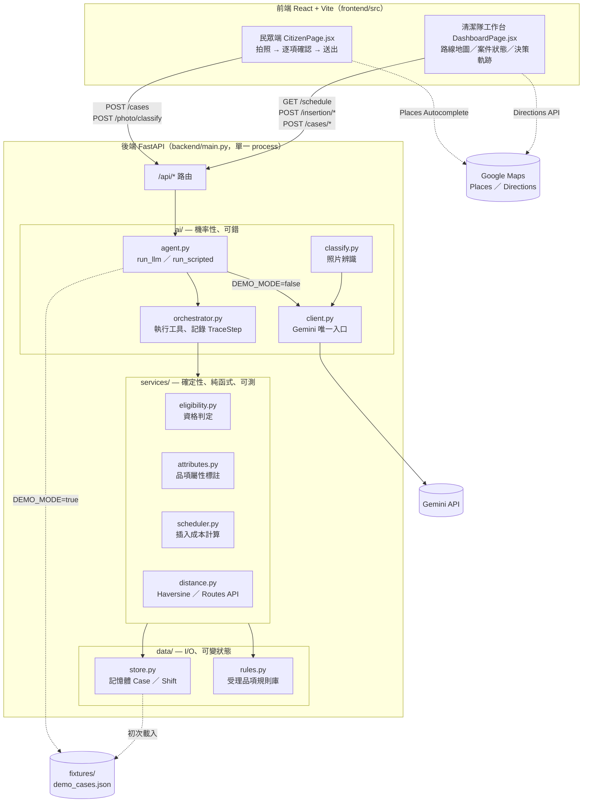

# CityTask｜大型廢棄物清運調度助手

**Agent × 智慧城市**——讓清潔隊班長早上打開系統，今天的案件已經排好路線、標好所需資源。

民眾拍照送件，agent（Gemini，經 Google ADK）逐項確認資格、算出建議插入哪個班次；
判定與排程本身是確定性的 Python（`services/`），AI 只負責聽懂輸入、把結果講成人話。
所有工具呼叫與判斷依據都留痕成「決策軌跡」，班長端可以逐步回放。

線上 Demo：https://citytask-1062745819472.asia-east1.run.app

---

## 系統架構



`ai/` 和 `services/` 是兩個實體分離的目錄，不是命名慣例：`services/` 內不得
`import ai`、不得有任何 I/O，同輸入永遠同輸出；判定結果與分數一律由
`services/` 產出，AI 只把結果講成人話、不得覆寫判定。這條界線是整個系統的
技術論述——評審問「AI 出錯怎麼辦」，答案是核心判定根本不經過 AI。

`DEMO_MODE=true`（或 Gemini 呼叫失敗時自動退回）改讀 `fixtures/demo_cases.json`，
完全不打外部 API，現場網路異常也演得完。

---

## 快速開始

```bash
# 後端（使用 uv）
cd backend
uv sync                       # 建 .venv 並裝好所有套件
cp .env.example .env          # 填入 GEMINI_API_KEY
uv run uvicorn main:app --reload --port 8000

# 前端（另開終端機）
cd frontend
npm install
cp .env.example .env          # 填入 VITE_GOOGLE_MAPS_API_KEY
npm run dev                   # http://localhost:5173
```

沒裝 uv：`curl -LsSf https://astral.sh/uv/install.sh | sh`

前端已設 proxy，一律打 `/api`，不用處理 CORS。

驗收：打開 http://localhost:5173，上傳一張大型廢棄物照片（或點「示範案例」），
跑完整個判定流程；`/dashboard` 能看到路線與決策軌跡。

驗證指令：

```bash
cd backend && uv run pytest                        # 只測 services/
grep -rn "import ai" backend/services/              # 應無輸出——架構鐵則的機械檢查
```

---

## 案件狀態流程

```
pending → scheduled / deferred → collecting → completed
              ↘ needs_review → completed（複核核准）／ rejected（複核駁回）
```

`scheduled`/`deferred`（agent 建議插入某班次）→ `collecting`/`completed`
是清潔隊在 `/dashboard` 手動點按鈕觸發的（`POST /api/cases/status`）。
`needs_review` 是現場複核，核准即代表已完成收運（`POST /api/cases/review`），
不會再重新走一次排程——複核當下就是完成事件本身，不是排程觸發點。

---

## API 一覽

完整請求／回應格式見 [`docs/api.md`](docs/api.md)。統一外殼 `{ ok, data, error }`。

| Method | Path | 用途 |
|---|---|---|
| GET | `/api/health` | 健康檢查 |
| GET | `/api/applicant-types` | 申請人身份選項 |
| GET | `/api/schedule` | 今日班次、路線、待複核、已完成案件 |
| POST | `/api/photo/classify` | 照片預覽辨識（不建立案件，供送件前確認畫面用） |
| POST | `/api/cases` | 民眾送件，走完整 agent 判定流程 |
| GET | `/api/cases/{id}` | 查詢單一案件 |
| POST | `/api/cases/status` | 清潔隊標記開始清運／已收運 |
| POST | `/api/cases/review` | `needs_review` 現場複核（核准＝完成／駁回） |
| POST | `/api/insertion/propose` | 試算插入某班次的成本（不真的插入） |
| POST | `/api/insertion/accept` | 清潔隊接受建議，真正插入路線 |
| POST | `/api/reset` | 重置成 fixture 初始狀態（demo 現場重來用） |

---

## 目錄

```
Dockerfile              Cloud Run 部署用：前端 build 靜態檔 + 後端一起包成單一 image
.dockerignore
.github/workflows/      push tag 自動部署（目前手動部署為主，見下方「部署」）

backend/
├── main.py              入口 + 路由；同步 def，SPA fallback 掛在最後
├── config.py             環境變數集中處
├── models.py             ★ Pydantic schema = 前後端契約
├── services/             ★ 確定性業務邏輯：eligibility／attributes／scheduler／distance
├── ai/
│   ├── agent.py          run_llm（真 Gemini + ADK）／run_scripted（DEMO_MODE）
│   ├── orchestrator.py   執行 agent 呼叫的工具，記錄 TraceStep
│   ├── tools.py           工具定義：check_eligibility／get_attributes／
│   │                      compute_insertion／check_capacity／query_shifts／ask_citizen
│   ├── classify.py        照片辨識
│   ├── client.py          Gemini 唯一入口
│   └── prompts/*.md       ★ prompt 存 .md
├── db/cloudsql/client.py  Cloud SQL 唯一連線入口（本機不設定完全不會被呼叫）
├── data/
│   ├── store.py           記憶體儲存：Case／Shift 唯一存放處（刻意不用資料庫）
│   └── rules.py           受理品項規則庫
├── fixtures/demo_cases.json   ★ Demo 固定素材（28 筆真實台北市地址，已 geocoding 校正）
└── tests/                 只測 services/

frontend/src/
├── api/client.js          所有後端呼叫集中一支
├── pages/
│   ├── CitizenPage.jsx     民眾端：拍照→四題確認→摘要→送出
│   └── DashboardPage.jsx   清潔隊工作台：路線地圖、決策軌跡、案件狀態操作
├── components/             CaseCard／MessageBlock／TraceList
├── lib/
│   ├── categorize.js       品項分類（圓餅圖用）
│   ├── googleMaps.js       Places／Directions 載入器
│   └── imageNormalize.js   上傳照片統一轉存 JPEG（含 HEIC 轉檔）
└── assets/logo.jpg

docs/
├── spec.md                 開發規格書
├── api.md                  介面契約
├── demo-script.md          Demo 腳本
└── day-of-gcp-checklist.md 比賽當天換 GCP 帳號要重新設定的東西
```

---

## 部署（Cloud Run）

單一 container：前端 build 成靜態檔，跟後端一起由同一個 FastAPI process serve，
同源不用處理 CORS。`main.py` 的靜態檔掛載用了自訂的 `SPAStaticFiles`，
找不到對應檔案時 fallback 回 `index.html`，讓 `/dashboard` 這類前端路由
直接刷新網址也不會 404。

```bash
# 1. build（Apple Silicon 記得指定 amd64，Cloud Run 不吃 arm64）
docker build --platform linux/amd64 \
  --build-arg VITE_GOOGLE_MAPS_API_KEY=你的Maps金鑰 \
  -t asia-east1-docker.pkg.dev/<PROJECT_ID>/<REPO>/citytask:test .

# 2. push（access token 約一小時過期，push 失敗先重新登入一次）
gcloud auth print-access-token | \
  docker login -u oauth2accesstoken --password-stdin https://asia-east1-docker.pkg.dev
docker push asia-east1-docker.pkg.dev/<PROJECT_ID>/<REPO>/citytask:test

# 3. deploy（GEMINI_API_KEY 走 Secret Manager；--max-instances=1
#    是刻意的：store.py 是記憶體狀態，多個 instance 之間不會同步）
gcloud run deploy citytask \
  --image=asia-east1-docker.pkg.dev/<PROJECT_ID>/<REPO>/citytask:test \
  --region=asia-east1 \
  --set-secrets=GEMINI_API_KEY=GEMINI_API_KEY:latest \
  --set-env-vars=DEMO_MODE=false,GEMINI_MODEL=gemini-3.7-flash \
  --max-instances=1 \
  --allow-unauthenticated
```

Vite 的 `VITE_*` 變數是 build time 烤進 JS 檔案，只能用 `--build-arg` 傳，
Cloud Run 的 `--set-env-vars` 對前端不生效。

---

## 刻意不放的東西

ORM、migration、使用者認證、TypeScript、狀態管理套件、`utils/` 萬用資料夾。

24 小時內這些全是純成本。狀態存記憶體或 React state 就夠，
除非題目需要跨 session／跨使用者保存資料，才用得到 `backend/db/`。

`backend/data/store.py` 是刻意的架構決定，不是偷懶：記憶體 dict 換取
零資料庫依賴的開發速度，代價是**單一 Cloud Run instance**（見上方部署指令的
`--max-instances=1`）與程序重啟就重置（`POST /api/reset` 本來就是把這件事
變成 demo 現場的功能，不是 bug）。

---

## 相關文件

- [`docs/spec.md`](docs/spec.md) — 完整開發規格（使用者定義、排程設計、決策依據）
- [`docs/api.md`](docs/api.md) — 請求／回應格式
- [`docs/demo-script.md`](docs/demo-script.md) — Demo 腳本
- [`AGENTS.md`](AGENTS.md) — 給 coding agent 的常駐上下文，架構鐵則的完整版本
